<h1>TCP</h1>

<h2>Passo 1 subimos o servidor e o Socket do client escritos na linguagem de Phyton na porta 65432</h2>

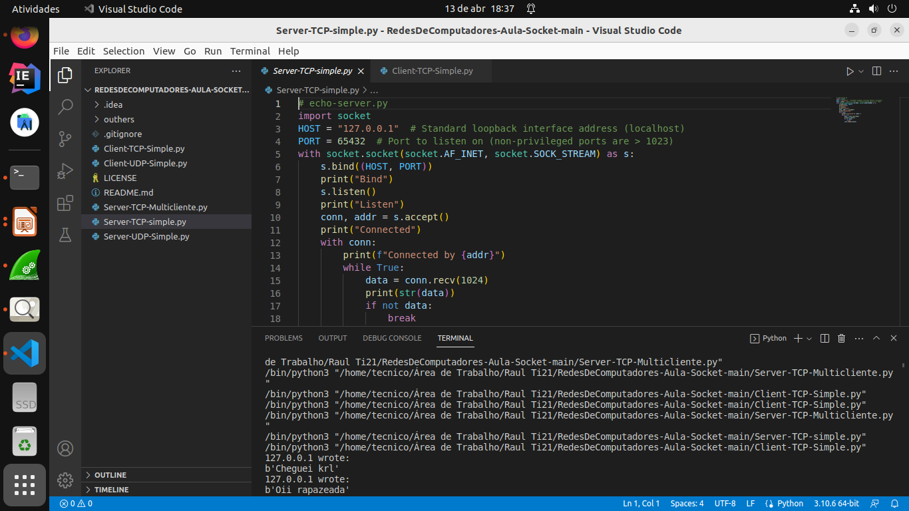

<h2>Passo 2 ouvimos os estados do protocolo TCP do servidor que já está rodando</h2>

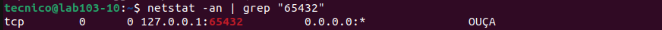

<h2>Passo 3 Subimos o WireShark</h2>

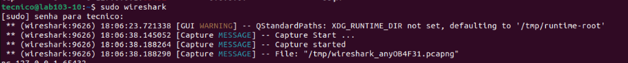

<h2>Passo 4 enviamos os dados</h2>

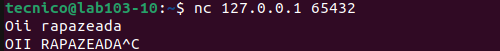

<h2>Passo 5 Filtramos a porta do TCP, identificando TCP e a porta em seguida</h2>

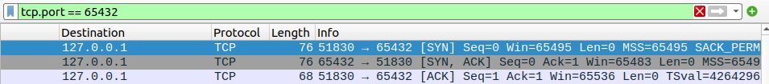

<h2>Passo 6 Verificando se a porta esta aberta, utilizando o NMAP </h2>

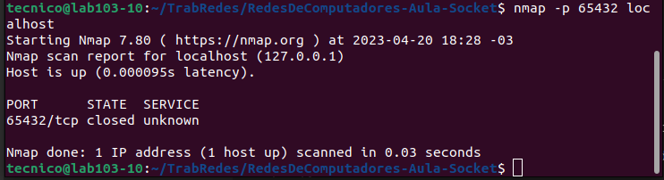

<h1>UDP</h1>

<h2>Passo 1 subimos o servidor e o Socket do client escritos na linguagem de Phyton na porta 65432</h2>

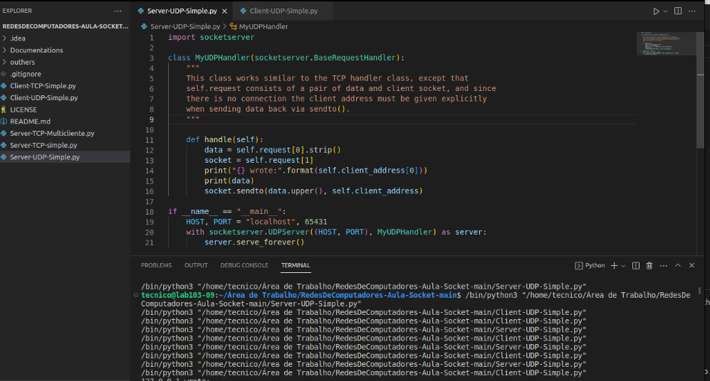

<h2>Passo 2 identificamos a diferença do UDPpara o TCP(UDP não tem estados!)</h2>

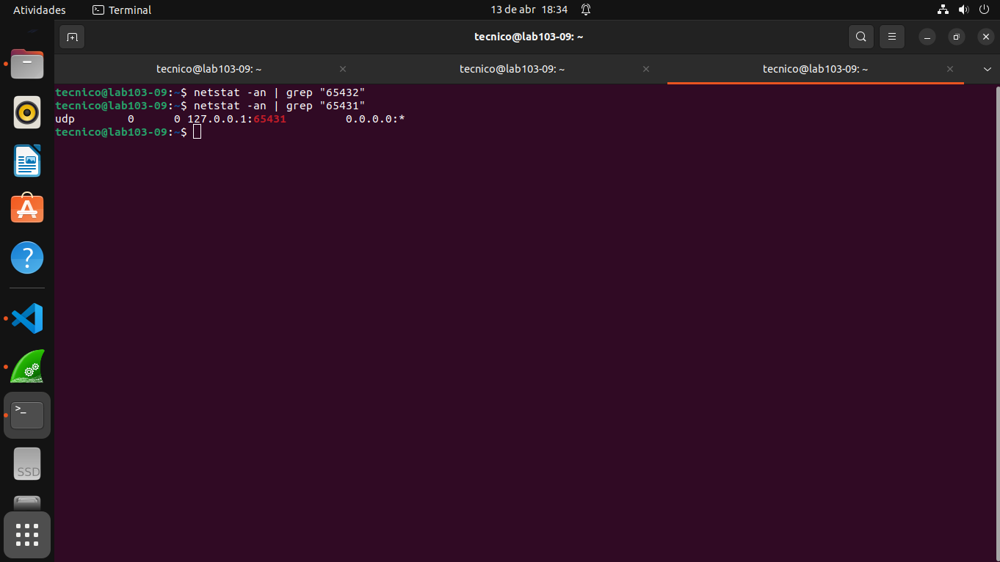

<h2>Passo 3 Subimos o ClientServer</h2>

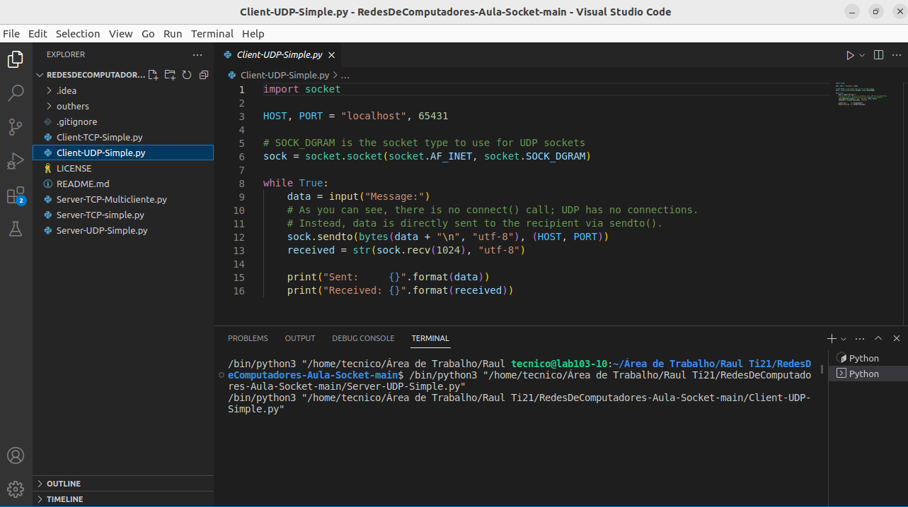

<h2>Passo 4 Subimos o Wireshark</h2>

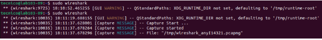

<h2>Passo 5 Escutando a conexão do servidor filtrando pela porta do UDP</h2>

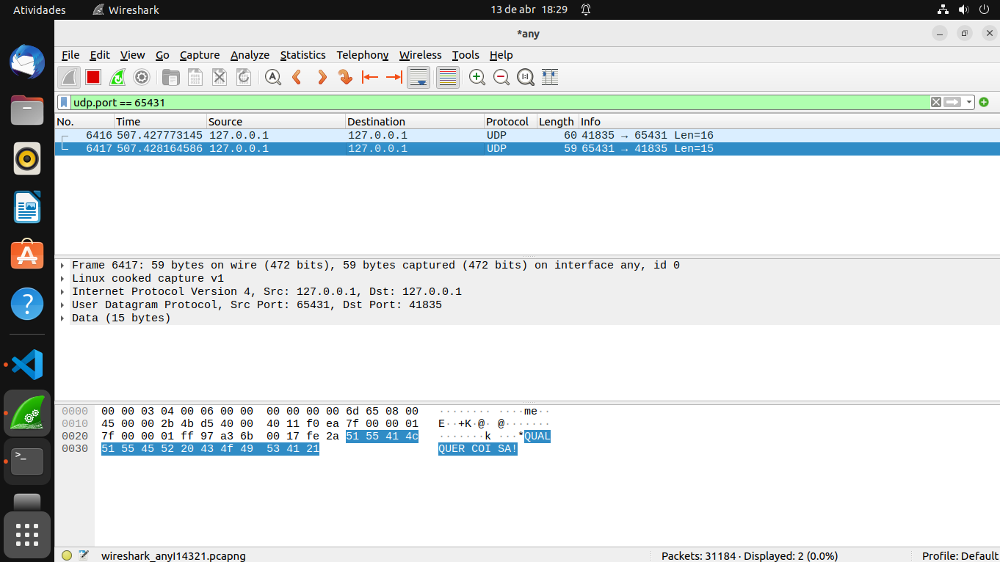

<h2>Passo 6 Verificando se a porta esta aberta, utilizando o NMAP </h2>

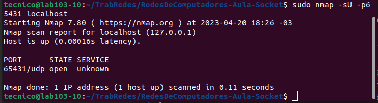