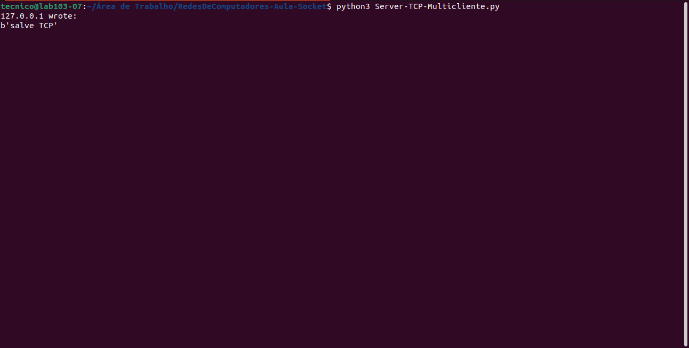
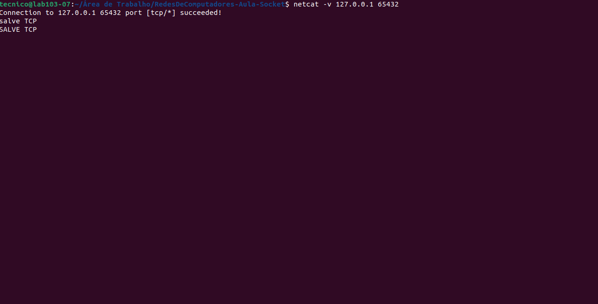
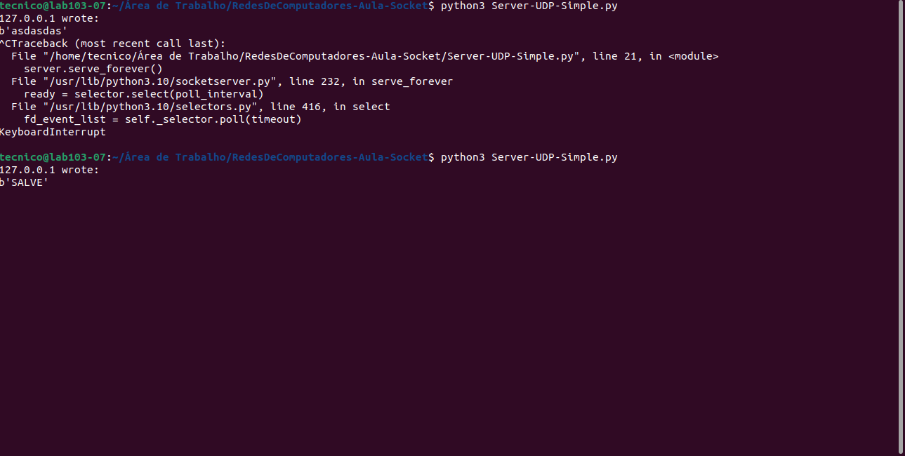
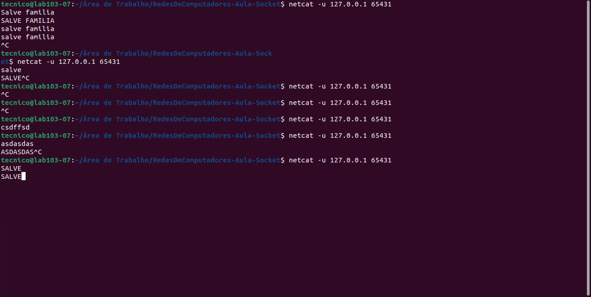
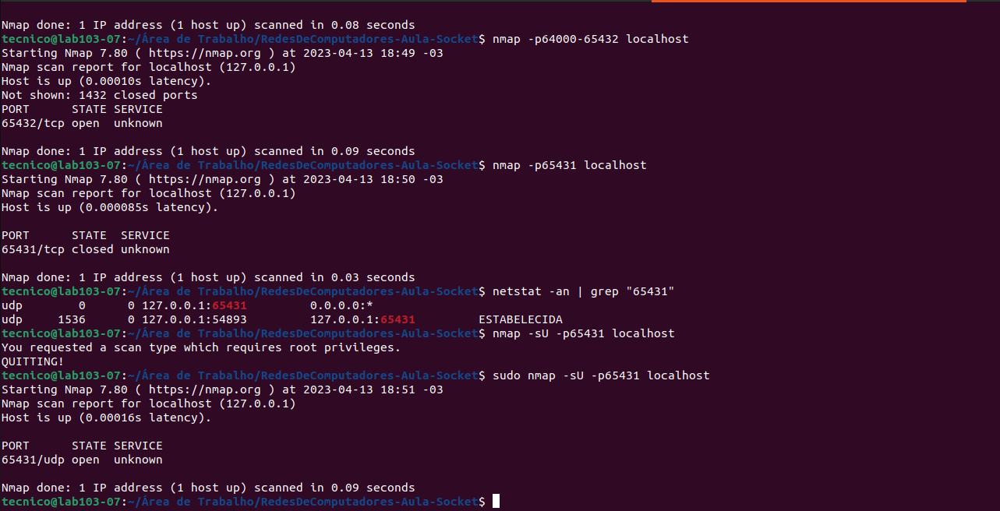
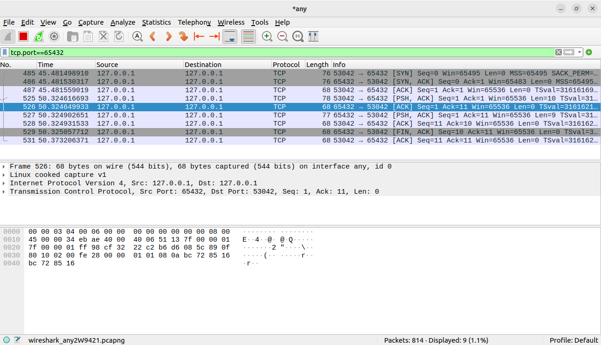
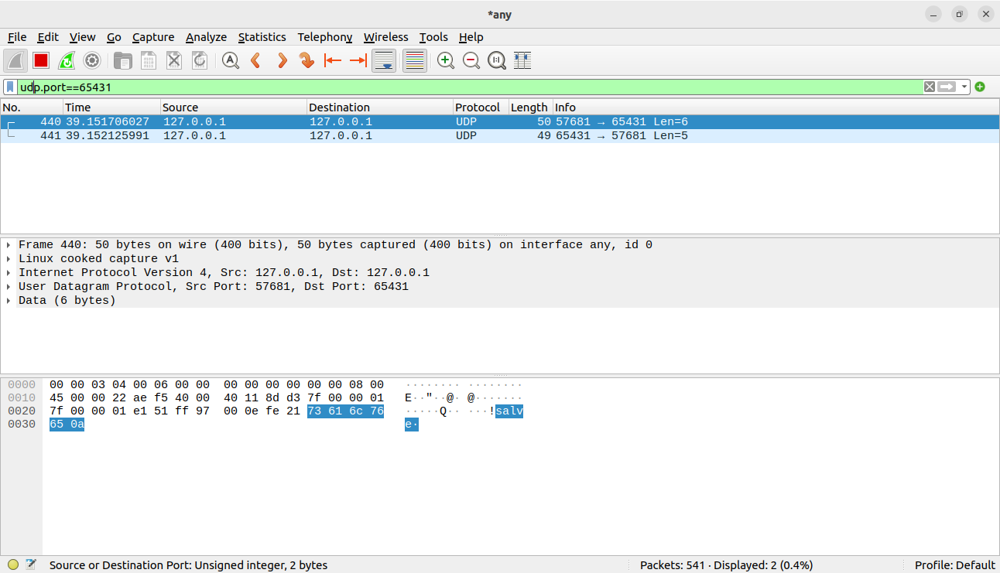

# Conexões de servidores TCP e UDP

##  TCP :

### Conectando ao SERVIDOR Multiclient TCP abrindo o terminal no diretório onde está o arquivo e utilizamos o seguinte comando

> `python3 Server-TCP-Multicliente.py`

Exemplo mostrado na imagem abaixo:
	

***

### Conectando ao Client TCP abrindo o terminal no diretório onde está o arquivo e utilizamos o seguinte comando

>`python3 netcat -v 127.0.0.1 65432`

Exemplo mostrado na imagem abaixo com inserção de mensagens que podem ser vistas na 1° imagem de conexão ao Servidor MultiClient TCP:

## UDP :

### Conectando ao SERVIDOR Simple Client UDP abrindo o terminal no diretório onde está o arquivo e utilizamos o seguinte comando

>`python3 Server-UDP-Simple.py`

Exemplo mostrado na imagem abaixo:

	
### Conectando ao Client UDP abrindo o terminal no diretório onde está o arquivo e utilizamos o seguinte comando

>`python3 netcat -u 127.0.0.1 65431`

Exemplo mostrado na imagem abaixo com envio de mensagens que podem ser vistas na imagem do Servidor UDP

	

***
	
## NMAP :

### Para identificar se a porta UDP estava aberta utilizamos o seguinte comando:

>`nmap -sU -p65431 localhost `

### Para identificar se a porta TCP estava aberta utilizamos o seguinte comando:

>`nmap -p65432 localhost`
	
### Exemplos mostrados na imagem abaixo:

Na imagem acima também podemos observar o uso do comando:
 

>`netstat -an | grep "65431"`

Usado para exibir informações de conexões de rede ativas no sistema e filtrar as conexões que estão sendo executadas na porta 65431.

 

*** 

## Instruções para uso do Wireshark para filtrar dados provenientes de conexões UDP e TCP
 

### Abrimos terminal e rodamos o seguinte comando para executar o programa:
>`sudo wireshark`
 

Com o programa aberto precisamos colocar um filtro para que ele capture o tráfego na interface de rede desejada.

Para filtrar apenas os pacotes de uma porta TCP ou UDP específica, use "TCP.port == [número da porta]" ou "UDP.port == [número da porta]", respectivamente.

 

Neste exemplo usaremos um filtro para TCP:
 

	TCP.PORT==65432

Na imagem abaixo podemos observar o filtro citado acima na área verde  e abaixo as capturas do tráfego pelo filtro:

Nesta imagem acima, podemos ver a conexão de 3 vias funcionando.  
- A primeira Via seria o `[SYN]`  que está na primeira linha do nosso tráfego. 
	O pacote `SYN` é enviado pelo cliente para iniciar a conexão.
- A segunda Via seria a `[SYN-ACK]` que está na segunda linha do nosso tráfego. 
	O pacote `SYN-ACK` é enviado pelo servidor em resposta ao SYN para confirmar que está aberto para a conexão.
- A terceira Via seria `[ACK]` que está na terceira linha do nosso tráfego. 
	O pacote `ACK` é enviado pelo cliente em resposta ao SYN-ACK para confirmar que a conexão está estabelecida.  

O estado de cada uma dessas etapas é:
- SYN: Estado "SYN_SENT"
- SYN-ACK: Estado "SYN_RCVD"
- ACK: Estado "ESTABLISHED"

Fora os estados citados acima, podemos citar ainda mais 2 estados que aparecem no tráfego:
- PSH:  é usado para indicar que os dados no pacote devem ser entregues imediatamente ao aplicativo de destino, sem aguardar a formação de um pacote maior. Isso é útil para transferir dados em tempo real ou em situações em que a latência é importante.
- FIN: é usado para indicar que o remetente não tem mais dados para enviar. Ao enviar um pacote com o flag FIN definido, o remetente está solicitando o encerramento da conexão.

Dito isso, o pacote `[PSH-ACK]` é usado para enviar dados de forma rápida e confiável pela rede, garantindo que eles sejam entregues corretamente e sem atrasos desnecessários. Enquanto que o pacote `[FIN-ACK]` é usado para encerrar uma conexão TCP de forma ordenada e confiável. Quando um dispositivo recebe um pacote com o flag FIN, ele sabe que o remetente não tem mais dados para enviar e pode responder com um pacote com o flag ACK para confirmar o encerramento da conexão. Depois que ambos os dispositivos enviaram pacotes com o flag FIN e ACK, a conexão é encerrada de forma ordenada e alocando adequadamente os recursos de rede.

***

 

Neste exemplo usaremos um filtro para UDP:
 

 	UDP.PORT==65431
Na imagem abaixo podemos observar o filtro citado acima na área verde  e abaixo as capturas do tráfego pelo filtro:

Ao contrário do TCP, o protocolo UDP é "connectionless", o que significa que não há conexão estabelecida antes de enviar dados. Cada pacote é enviado independentemente.

 

***
 

## Camadas OSI usadas em TCP e UDP
 

-	O TCP se comunica diretamente com a camada de aplicação (camada 7) por meio de soquetes, que são interfaces de programação de aplicativos (APIs) usadas para estabelecer conexões de rede entre aplicativos em diferentes dispositivos. Além disso, o TCP também usa serviços fornecidos pela camada de rede (camada 3) e pela camada de enlace de dados (camada 2) para enviar e receber pacotes de dados pela rede.
- O UDP se comunica diretamente com a camada de aplicação (camada 7) por meio de soquetes, assim como o TCP. No entanto, ao contrário do TCP, o UDP não fornece confiabilidade de comunicação e controle de fluxo. Em vez disso, o UDP é um protocolo simples e sem conexão que envia datagramas de forma independente pela rede.
O UDP também usa serviços fornecidos pela camada de rede (camada 3) e pela camada de enlace de dados (camada 2) para enviar e receber pacotes de dados pela rede.

 

***
 

## Conclusão
 
Em geral, tanto o Wireshark quanto o NMAP são ferramentas valiosas para profissionais de TI que precisam monitorar e analisar o tráfego de rede. O Wireshark é essencial para solucionar problemas e identificar gargalos de desempenho, oferecendo recursos avançados de filtragem, análise de fluxo de dados e estatísticas de rede. Já o NMAP é uma ferramenta poderosa para monitorar a atividade da rede, avaliar a segurança do sistema e detectar vulnerabilidades, com suporte para protocolos TCP e UDP e recursos avançados de varredura de portas.

Ambas as ferramentas podem ser usadas em conjunto para fornecer uma visão abrangente da atividade da rede, permitindo que os usuários identifiquem problemas de desempenho, detectem atividades maliciosas e implementem medidas de segurança. Em resumo, o Wireshark e o NMAP são ferramentas essenciais para profissionais de TI que desejam garantir a eficiência e a segurança de suas redes.