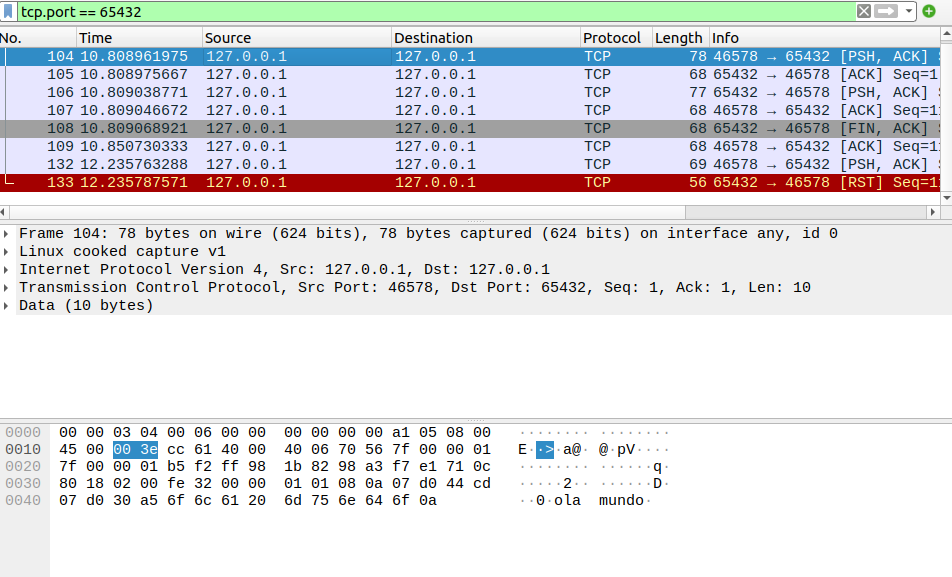
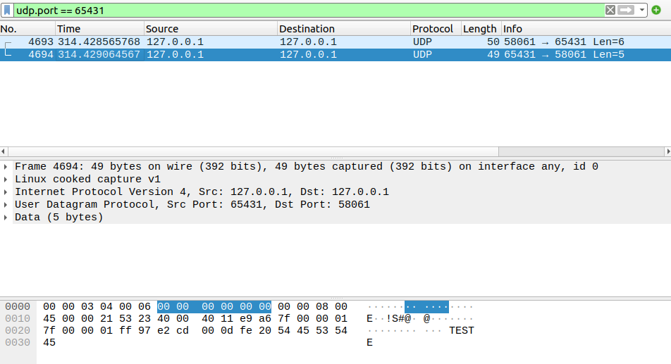
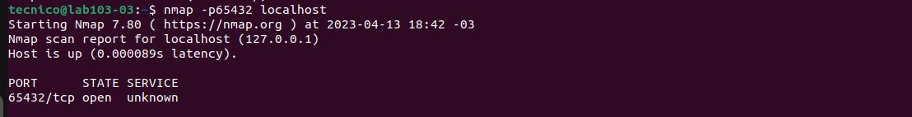
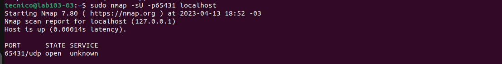
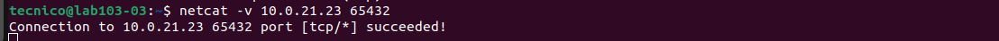
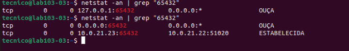

    Nomes: João Gabriel, Felipe e Marcela.
***

# Trabalho Redes de Computadores

### 1)Na conexão TCP identifique e explique cada estado da conexão 3 vias (three-way).
***
    - Socket: Criar um novo ponto final de comunicação;
    - Bind: Anexar um endereço local a um soquete;
    - Listen: Anunciar a disposição para aceitar conexões, mostra tamanho da fila;
    - Accept: Bloquear o responsável pela chamada até uma tentativa de conexão ser recebida;
    - Connect: Tentar estabeleceruma conexão ativamente;
    - Send: Enviar alguns dados através da conexão;
    - Receive: Receber alguns dados da conexão;
    - Close: Encerrar conexão;
#
### 2) Na conexão UDP identifique a diferença de TCP.
***
    O protocolo UDP não precisa estabelecer uma conexão para funcionar,enquanto que o TCP sim. No quesito velocidade, o protocolo UDP apresenta uma velocidade maior quando comparado ao TCP. Os envios realizados apresentam uma sequência estabelecida no protocolo TCP, o contrário ocorre com o UDP. O feedback sobre processos de envio para o usuário são efetivados no protocolo TCP, diferente do UDP, o qual não fornece o feedback. A retransmissão se um pacote for perdido é permitida no protocolo TCP,enquanto que no UDP não há retransmissão.
    A entrega dos pacotes enviados é garantida no protocolo TCP, no UDP não há garantia.
#

### 3) Mostre os filtros de TCP e UDP.
***
    Filtro TCP

***
    Filtro UDP

#
### 4) Use o programa "nmap" para verificar a porta aberta.
    nmap TCP

***
    nmap UDP

#
### 5) Liste as camadas OSI usadas em UDP e TCP.

    1. Camada Física
    2. Camada de Enlace de Dados
    3. Camada de Rede
    4. Camada de Transporte
    5. Camada de Sessão
    6. Camada de Apresentação
    7. Camada de Aplicação
#
### 6) Faça uma Branch no GitHub e coloque as instruções de como usou no README.md
#
### 7) Teste cliente e server entre computadores do LAB.
***
    Conexão entre PCs TCP - Client

***
    Conexão entre PCs TCP - Server

#

